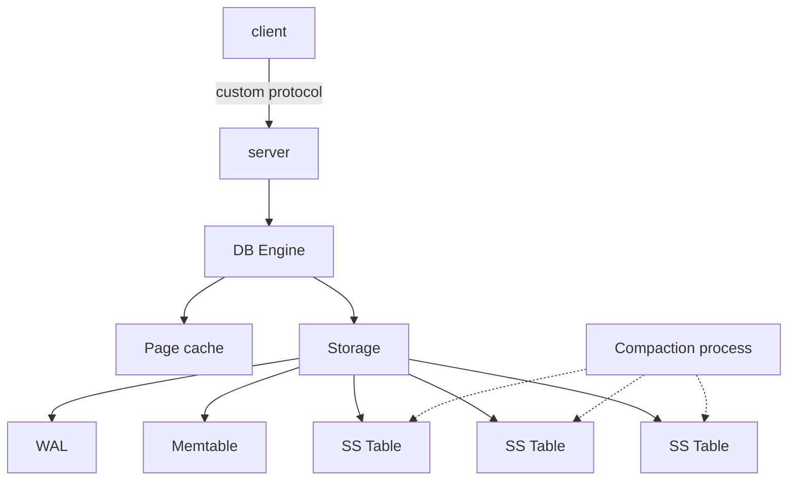

# Architecture

## Top-level Design

- Client-server single-node DB engine
- TCP-based custom binary protocol
- Async server (`tokio` or other)
- A queue- or pipe-based communication between server workers and DB engine (`std::sync::mpsc` or Tokio MPSC)
- Single threaded DB engine (no locking required)
- LSM-tree based storage
  - All writes go to a memtable
  - Once memtable is full, we flush data to SS-table
  - Background compaction process merges keys before flushing an SS-table
  - SS-tables are immutable
  - (Optional) Several SS-table layers
  - Lookup: memtable -> SS-tables
    - Bloom filters for speed up
    - Reading data in pages
    - In-memory caches:
      - SS-table pages
      - key -> value
      - key -> value location
  - WAL for recovery
    - limited size
    - drop tail after checkpoints / SS-table flushes

## Server -> Storage Comms

Async server with multiple workers needs a syncronized mechanism to send messages to communicate with single-threaded
storage engine. A sutiable apporach here is the use of MPSC queue (multiple producers, single consumer).

The selection of MPSC implementation affects blocking/non-blocking nature of the server, latency and throughput.

The native `std::sync::mpsc` (sync+mutex) implementation might be enough for the MVP. Possible options for later:

- Tokio MPSC
- `crossbeam::channel`
- To be evaluated

## Network Protocol

### Data Serialization

Primitive types are serialized as following:

- data size as 8 byte unsigned, big-endian
- numeric types as is, big-endian
- boolean: 1 byte `0` or `1`
- strings: first goes data size (8 bytes), then string characters as UTF-8
- `Option<T>`: boolean to show whether the value is present, then `T` serialization if present

_TBD_

## LSM-Tree

_TBD_

## Recovery

_TBD_

## Caching

_TBD_
