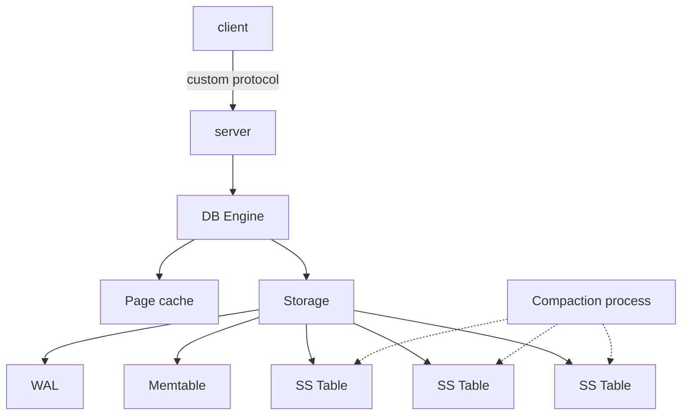

# Architecture

## Top-level Design

- Client-server single-node DB engine
- TCP-based custom binary protocol
- Async server (`tornado` or other)
- A queue- or pipe-based communication between server workers and DB engine
- Single threaded DB engine (no locking required)
- LSM-tree based storage
  - All writes go to a memtable
  - Once memtable is full, we flush data to SS-table
  - Background compaction process merges keys before flushing an SS-table
  - SS-tables are immutable
  - (Optional) Several SS-table layers
  - Lookup: memtable -> SS-tables
    - Bloom filters for speed up
    - Reading data in pages
    - In-memory cache for SS-table pages
  - WAL for recovery
    - limited size
    - drop tail after checkpoints / SS-table flushes

## Network Protocol

_TBD_

## LSM-Tree

_TBD_

## Recovery

_TBD_

## Caching

_TBD_
